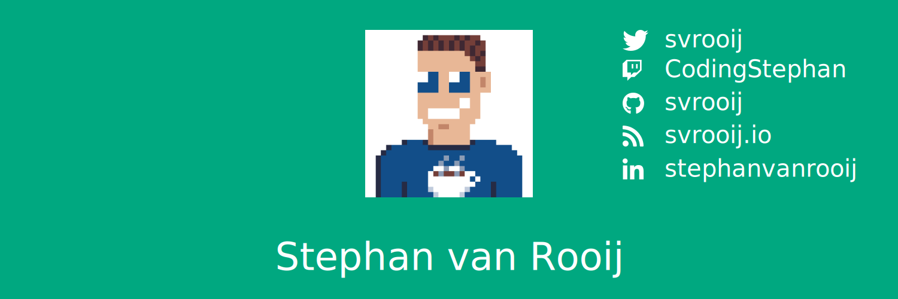

<h1 align='center'> Hi! :wave:</h1>

- :notebook: I blog at [svrooij.io][link_blog]
- 💬 Ask me about `Entra ID`, `DOTNET`, `App packaging`, `Home Automation` and `Sonos`
- 📫 How to reach me: `{firstName}@{blog-domain}`
- ⚡ Fun fact: **I'm Dutch, but I don't like cheese**
- 👨‍💻 Microsoft MVP in Security (2022/2023/...?)

<h2 align="center">📦 Open-source packages 📦</h2>

I've created several open-source packages, these are the once that keep my spare time occupied:

- [WinTuner](https://wintuner.app) A PowerShell module to quickly package and deploy apps from winget to Intune. [source](https://github.com/svrooij/wingetintune)
- [Unobtanium.Web.Proxy](https://github.com/svrooij/titanium-web-proxy) intercepting http(s) proxy, that I'm trying to reboot. Which is the base for the [Microsoft dev proxy](https://github.com/microsoft/dev-proxy)
- [Sonos2mqtt](https://sonos2mqtt.svrooij.io) Small service that allows you to control your sonos speakers from your mqtt server.
- All the other sonos stuff I've build [sonos-ts](https://sonos-ts.svrooij.io) sonos in typescript, [sonos-net](https://github.com/svrooij/sonos-net) sonos in dotnet and [unofficial sonos docs](https://sonos.svrooij.io)
- [PowerShell Dependency Injection](https://github.com/svrooij/PowerShell.DependencyInjection) Want to create a PowerShell library in c#? Check out this library that gives you `ILogger` and `async` support and the ability to resolve services from dependency injection.

<h2 align="center">🤝 Socials 🙌</h2>

[![LinkedIn Profile][badge_linkedin]][link_linkedin]
[![Link Mastodon][badge_mastodon]][link_mastodon]
[![Follow on Twitter][badge_twitter]][link_twitter]

<h2 align="center">📝 Recent Posts 📖</h2>

<!-- start posts -->
- [Hyper-V template for Intune](https://svrooij.io/2024/08/02/hyper-v-template-intune/)
- [Integration tests on protected API](https://svrooij.io/2024/07/10/integration-tests-protected-api/)
- [Kiota with dependency injection](https://svrooij.io/2024/07/03/kiota-dependency-injection/)
- [Authentication using certificate - Entra ID](https://svrooij.io/2024/06/05/authentication-certificate-key-vault/)
- [What have you been up to?](https://svrooij.io/2024/05/21/what-have-you-been-up-to/)
<!-- end posts -->

These posts are automatically updated by [dotnet-feeder](https://github.com/svrooij/dotnet-feeder)

<h2 align="center">🥷 Hackathons 🧑‍💻</h2>

I enjoy hackathons, if you're organizing one that might interest me give me a ping.

A [**honorable mention**](https://devblogs.microsoft.com/microsoft365dev/announcing-the-hack-together-microsoft-graph-and-net-winners/) for extending the Graph SDK for .NET during the hackathon.

[badge_linkedin]: https://img.shields.io/badge/stephanvanrooij-blue?style=for-the-badge&logo=linkedin
[badge_mastodon]: https://img.shields.io/mastodon/follow/109502876771613420?domain=https%3A%2F%2Fdotnet.social&label=%40svrooij%40dotnet.social&logo=mastodon&logoColor=white&style=for-the-badge
[badge_twitter]: https://img.shields.io/twitter/follow/svrooij?logo=twitter&style=for-the-badge
[link_blog]: https://svrooij.io/
[link_linkedin]: https://www.linkedin.com/in/stephanvanrooij
[link_mastodon]: https://dotnet.social/@svrooij
[link_twitter]: https://twitter.com/svrooij
